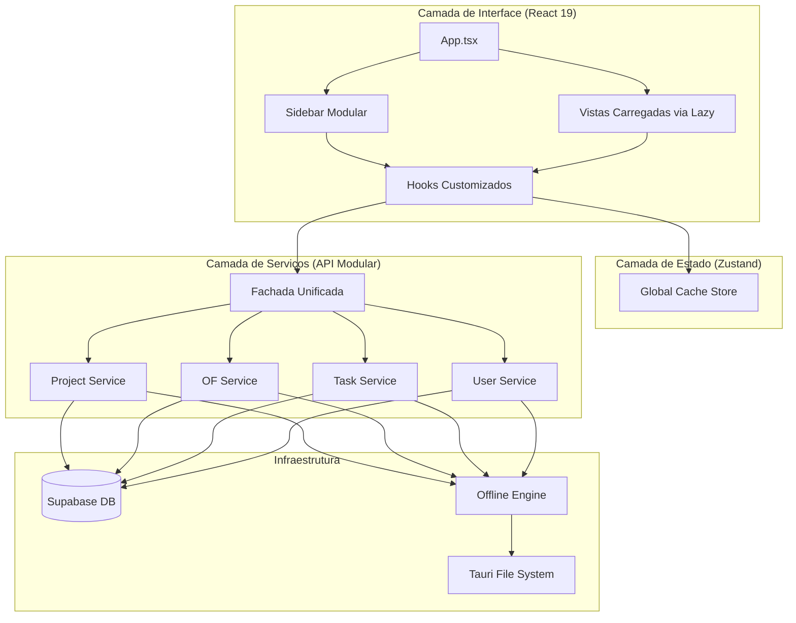

<div align="center">
  
  <h1>Nexar HUB</h1>
  <p><strong>Industrial Work Manager de Alta Performance</strong></p>
  <p>
    
    
    
    
    
  </p>
</div>

---

## 📌 Visão Geral

O **Nexar HUB** é uma solução desktop nativa (Windows & macOS) desenvolvida para a gestão e monitorização de fluxos de trabalho industriais. Projetada para substituir a fragmentação de ficheiros Excel, a aplicação oferece um ambiente centralizado, seguro e **offline-first** para o controlo total da produção.

A versão **v1.1.0** marca um salto qualitativo na maturidade do projeto, introduzindo uma arquitetura modular, navegação instantânea e otimizações de performance de alto nível.

---

## 🏗️ Arquitetura do Sistema

A aplicação utiliza uma estrutura modular para garantir escalabilidade e separação de responsabilidades. Abaixo encontra-se o mapa de componentes e fluxo de dados:



---

## 🚀 Funcionalidades Principais (v1.1.0)

### ⚡ Navegação Instantânea
- **Cache Global Inteligente**: Obras e Ordens de Fabrico são pré-carregadas no store global, eliminando ecrãs de "Loading" durante a navegação.
- **Code-Splitting**: Utilização de `React.lazy` para carregar módulos apenas quando necessários, acelerando o arranque inicial.

### 📴 Robustez Offline-First
- **Full Sync**: Funcionamento 100% autónomo sem internet com sincronização automática via fila de mutações.
- **Persistência Local**: Cache de dados em JSON nativo para acesso imediato ao histórico.

### 🔐 Segurança e RBAC
- **Controlo de Acessos**: Diferenciação entre perfis Admin e User com Row Level Security (RLS).
- **Proteção de Credenciais**: Fluxo de alteração de palavra-passe com validação obrigatória da credencial atual.

### 📊 Monitorização Industrial
- **Dashboard em Tempo Real**: Ponto de situação global com alertas visuais de prazos e inatividade.
- **Auto-Arquivo**: Gestão automática de portfólio para obras concluídas.
- **Exportação Profissional**: Gerador de relatórios Excel estilizados e backups em JSON.

---

## 💻 Stack Técnico

- **Runtime**: [Tauri v2](https://tauri.app/) (Rust Core)
- **Frontend**: React 19 + TypeScript 5.8
- **Estilos**: Tailwind CSS v4 (com animações de fluidez)
- **Estado**: Zustand v5 (com persistência de cache)
- **Backend/Auth**: Supabase (PostgreSQL)
- **Ordenação**: `@dnd-kit` para Drag & Drop industrial.

---

## ⚙️ Instalação e Build

### Requisitos
- Node.js ≥ 22
- Rust (via rustup)
- Tauri CLI v2

### Setup
```bash
npm install
npm run tauri dev
```

### Build para Produção
```bash
npm run tauri build
```

---

## 🍎 Notas macOS
A aplicação dispõe de suporte nativo para arquitetura Apple Silicon. Devido às políticas de segurança da Apple:
- Após instalar, se for bloqueado pelo Gatekeeper, aceda a **Definições do Sistema > Privacidade e Segurança** e clique em **"Abrir Mesmo Assim"**.

---
<div align="center">
  <p>Desenvolvido para excelência industrial e produtividade máxima.</p>
</div>
