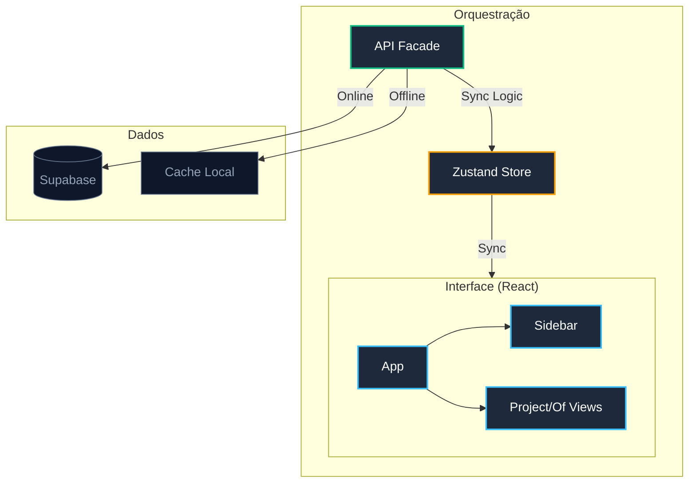

# Nexar HUB

Gestor de projetos e ordens de fabrico (OF) desenvolvido em Tauri e React, com foco em performance e funcionamento offline-first.

## 🏗️ Arquitetura do Sistema



## 🛠️ Stack Tecnológica

- **Frontend:** React 19, TypeScript 5.8, Tailwind CSS v4
- **Estado:** Zustand v5 (com persistência local)
- **Backend:** Supabase (Auth, DB, RLS)
- **Desktop:** Tauri v2 (Rust)
- **Exportação:** XLSX (Excel)

## ✨ Funcionalidades

- **Gestão Hierárquica:** Organização por Projetos, Ordens de Fabrico e Tarefas.
- **Offline-First:** Sincronização automática de dados após retoma de ligação à internet.
- **Administração:** Controlo de utilizadores e modo de visualização de dashboard individual.
- **Pesquisa Rápida:** Atalho `CMD + K` para acesso imediato a qualquer registo.
- **Exportação:** Geração de relatórios Excel formatados.

## ⚙️ Desenvolvimento

### Documentação Técnica
Para gerar a documentação das interfaces e serviços (via TypeDoc):
```bash
npm run docs
npm run serve-docs
```

### Instalação
```bash
npm install
npm run tauri dev
```

### Build
```bash
npm run tauri build
```
